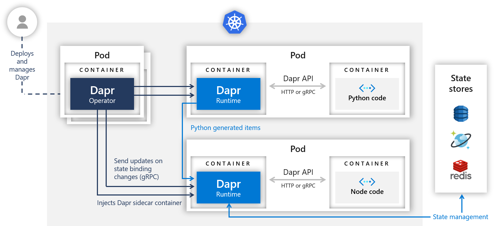

# Hello Dapr

This tutorial will get you up and running with Dapr in a Kubernetes cluster using [Dapr AKS Extension](https://learn.microsoft.com/en-us/azure/aks/dapr-overview). You'll be deploying a Node.js app that subscribes to order messages and persists them in [Azure Cache For Redis](). Later on, you'll deploy a Python app to act as the publisher. The following architecture diagram illustrates the components that make up this quickstart:



## Prerequisites

- An Azure subscription. If you don't have an Azure subscription, you can create a [free account](https://azure.microsoft.com/free).
- [Azure CLI](https://learn.microsoft.com/en-us/cli/azure/install-azure-cli) or [Azure PowerShell](https://learn.microsoft.com/en-us/powershell/azure/install-az-ps) installed.
- An AKS Cluster with
  - [Workload Identity](https://learn.microsoft.com/en-us/azure/aks/workload-identity-deploy-cluster#create-an-aks-cluster) enabled.
  - [Managed identity](https://learn.microsoft.com/en-us/azure/aks/workload-identity-deploy-cluster#create-an-aks-cluster)
  - [A Kubernetes service account](https://learn.microsoft.com/en-us/azure/aks/workload-identity-deploy-cluster#create-a-kubernetes-service-account)
  - [Federated identity credential](https://learn.microsoft.com/en-us/azure/aks/workload-identity-deploy-cluster#create-an-aks-cluster)
  - [Dapr cluster extension](https://learn.microsoft.com/en-us/azure/aks/dapr-overview) installed on the AKS cluster.
- [kubectl](https://kubernetes.io/docs/tasks/tools/install-kubectl/) installed locally.

## Clone the repository

1. Clone this repository using git clone command:
    ```bash
    git clone https://github.com/Azure-Samples/dapr-aks-extension-quickstart
    ```

1. Navigate to the repository using `cd`:
    ```bash
    cd dapr-aks-extension-quickstart
    ```

## Create and Configure a Redis Store

Open the [Azure portal](https://portal.azure.com/#create/Microsoft.Cache) to start the Azure Cache for Redis creation flow.

1. Follow the instructions in the [Create an open-source Redis cache quickstart](https://learn.microsoft.com/en-us/azure/azure-cache-for-redis/quickstart-create-redis).
1. Fill out the necessary information.
1. Select Create to start the Redis instance deployment.
1. Take note of:
   - The hostname of your Redis instance, which you can retrieve from the **Overview** section of your cache in Azure. The hostname might be similar to the following example: `xxxxxx.redis.cache.windows.net`. It will be used to replace `<REDIS_HOST>` later in the `redis.yaml` file.
   - The SSL Port of the Redis cache instance, which you can retrieve from the **Advanced Settings** blade in your cache in the portal. The default value of the port is 6380. It will be used to replace `<REDIS_PORT>` later in the `redis.yaml` file.
1. Ensure `Microsoft Entra Authentication` is enabled under **Authentication** blade.
1. Add the [managed Identity](https://learn.microsoft.com/en-us/azure/aks/workload-identity-deploy-cluster#create-a-managed-identity) used for enabling workload idenity in AKS Cluster as Redis User with `Data Owner` permissions under `Data Access Configuration` blade.
1. For this quickstart scenario, click **Enable public network access**

## Create Redis statestore component

### Configure the Dapr Component

1. In your preferred code editor, navigate to the `deploy` directory in the sample and open `redis.yaml`.

1. Replace the `redisHost` value with the `<REDIS_HOST>:<REDIS_PORT>` [you saved earlier from Azure portal](#create-and-configure-a-redis-store). The value would be similar to the following example: `xxxxxx.redis.cache.windows.net:6380`.

1. Note that the component is configured to use Entra ID Authentication using workload identity enabled for AKS cluster, so no access keys are required. 
    ```yaml
    - name: useEntraID
      value: "true"
    - name: enableTLS
      value: true
    ```

### Apply the configuration

Before continuing, make sure you've set up an AKS cluster with workload identity, managed identity, a Kubernetes service account, and federated identity credentials. See the [prerequisites](#prerequisites) for links to instructions.

1. In the terminal, apply the `redis.yaml` file using the `kubectl apply` command.
    ```bash
    kubectl apply -f ./deploy/redis.yaml
    ```

    You should see output similar to the following example output:
    ```
    component.dapr.io/statestore created
    ```

1. Verify your state store was successfully configured using the `kubectl get component` command.

    ```bash
    kubectl get component statestore -o yaml
    ```

## Deploy the Node.js app with the Dapr sidecar

### Configure the Node.js app

1. Navigate to the `deploy` directory and open `node.yaml`.

1. Replace the `<SERVICE_ACCOUNT_NAME>` with [the service account name you created](https://learn.microsoft.com/en-us/azure/aks/workload-identity-deploy-cluster#create-a-kubernetes-service-account). 
   - This should be the same service account which is used to create the federated credential.

1. Note that the pod spec has the label added to use workload identity, as mentioned [here](https://learn.microsoft.com/en-us/azure/aks/workload-identity-deploy-cluster#deploy-your-application):
    ```yaml
    labels:
      app: node
      azure.workload.identity/use: "true"
    ```

### Apply the configuration

This section deploys the Node.js app to Kubernetes. The Dapr control plane automatically injects the Dapr sidecar to the Pod. If you take a look at the node.yaml file, you see how Dapr is enabled for that deployment:

- `dapr.io/enabled: true`: tells the Dapr control plane to inject a sidecar to this deployment.
- `dapr.io/app-id: nodeapp`: assigns a unique ID or name to the Dapr application, so it can be sent messages to and communicated with by other Dapr apps.

1. Apply the Node.js app deployment to your cluster using the `kubectl apply` command.

    ```bash
    kubectl apply -f ./deploy/node.yaml
    ```

1. Note that Kubernetes deployments are asynchronous, which means you need to wait for the deployment to complete before moving on to the next steps. You can do so with the following command:

    ```bash
    kubectl rollout status deploy/nodeapp
    ```

1. Access your service using the `kubectl get svc` command.
    ```bash
    kubectl get svc nodeapp
    ```

3. Make note of the `EXTERNAL-IP` in the output.

## Verify the service

1. Call the service using curl with your EXTERNAL-IP.

    ```bash
    curl $EXTERNAL_IP/ports
    ```

    You should see output similar to the following example output:

    ```
    {"DAPR_HTTP_PORT":"3500","DAPR_GRPC_PORT":"50001"}
    ```

1. Submit an order to the application using curl.

    ```bash
    curl --request POST --data "@sample.json" --header Content-Type:application/json $EXTERNAL_IP/neworder
    ```

1. Confirm the order has persisted by requesting it using curl.

    ```bash
    curl $EXTERNAL_IP/order
    ```

    You should see output similar to the following example output:

    ```
    { "orderId": "42" }
    ```

## Deploy the Python app with the Dapr sidecar

### Configure the Python app

1. Navigate to the `deploy` directory and open `python.yaml`.

1. Replace the `<SERVICE_ACCOUNT_NAME>` with [the service account name you created](https://learn.microsoft.com/en-us/azure/aks/workload-identity-deploy-cluster#create-a-kubernetes-service-account). This should be the same service account [which is used for the node.js app](#configure-the-nodejs-app).

1. Note that the pod spec has the label added to use workload identity, as mentioned [here](https://learn.microsoft.com/en-us/azure/aks/workload-identity-deploy-cluster#deploy-your-application):

    ```yaml
    labels:
      app: node
      azure.workload.identity/use: "true"
    ```

### Apply the configuration

In the `python` directory, `app.py` is an example of a basic Python app that posts JSON messages to `localhost:3500`, which is the default listening port for Dapr. You can invoke the Node.js application's `neworder` endpoint by posting to `v1.0/invoke/nodeapp/method/neworder`. The message contains some data with an orderId that increments once per second:

   ```python
   n = 0
   while True:
       n += 1
       message = {"data": {"orderId": n}}

       try:
           response = requests.post(dapr_url, json=message)
       except Exception as e:
           print(e)

       time.sleep(1)
   ```

1. Deploy the Python app to your Kubernetes cluster using the `kubectl apply` command.

    ```bash
    kubectl apply -f ./deploy/python.yaml
    ```

    As with the previous command, you need to wait for the deployment to complete before moving on to the next steps. You can do so with the following command:

    ```bash
    kubectl rollout status deploy/pythonapp
    ```

## Observe messages and confirm persistence

Now that both the Node.js and Python applications are deployed, you can watch messages come through.

1. Get the logs of the Node.js app using the kubectl logs command.

    ```bash
    kubectl logs --selector=app=node -c node --tail=-1
    ```

    If the deployments were successful, you should see logs like the following example logs:

    ```
    Got a new order! Order ID: 1
    Successfully persisted state
    Got a new order! Order ID: 2
    Successfully persisted state
    Got a new order! Order ID: 3
    Successfully persisted state
    ```

1. Call the Node.js app's order endpoint to get the latest order using curl.

    ```bash
    curl $EXTERNAL_IP/order
    ```

    You should see the latest JSON in the response similar to the following example output:

    ```
    { "orderId": "42" }
    ```

##  Cleanup

1. Once you're done, you can spin down your Kubernetes resources by running the following command:

    ```bash
    kubectl delete -f ./deploy
    ```

    This spins down each resource defined by the `.yaml` files in the `deploy` directory, including the statestore component, nodeapp, and python app.

1. Remove the resource group, cluster, namespace, and all related resources using the `az group delete` command.

    ```bash
    az group delete --name <RESOURCE_GROUP>
    ```


## Deploying your code

Now that you're successfully working with Dapr, you probably want to update the code to fit your scenario. The Node.js and Python apps that make up this quickstart are deployed from container images hosted on a private [Azure Container Registry](https://azure.microsoft.com/en-us/services/container-registry/). To create new images with updated code, you'll first need to install docker on your machine. Next, follow these steps:

1. Update Node or Python code as you see fit!
2. Navigate to the directory of the app you want to build a new image for, e.g. `node` or `python`.
3. Run `docker build -t <YOUR_IMAGE_NAME> . `. You can name your image whatever you like. If you're planning on hosting it on docker hub, then it should start with `<YOUR_DOCKERHUB_USERNAME>/`.
4. Once your image has built you can see it on your machines by running `docker images`.
5. To publish your docker image to docker hub (or another registry), first login: `docker login`. Then run`docker push <YOUR IMAGE NAME>`.
6. Update your .yaml file to reflect the new image name.
7. Deploy your updated Dapr enabled app: `kubectl apply -f <YOUR APP NAME>.yaml`.

## Next steps

- Try out other Dapr APIs and components with OSS [quickstarts](https://github.com/dapr/quickstarts).
- Learn more about Dapr in the [Dapr overview](https://docs.dapr.io/concepts/overview/) documentation.
- Explore [Dapr concepts](https://docs.dapr.io/concepts/) such as building blocks and components in the Dapr documentation