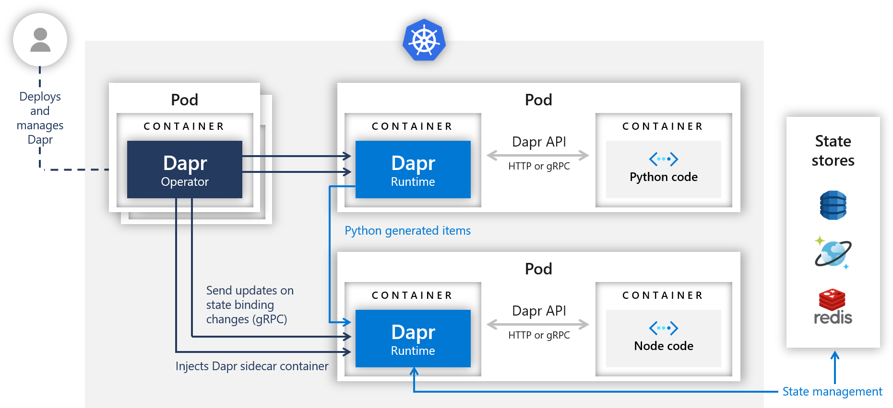

# Dapr AKS Extension Quickstart

Deploy a Node.js application and Python publisher to an existing Azure Kubernetes Service (AKS) cluster with the Dapr extension.



This quickstart demonstrates:

- Dapr sidecar injection.
- Service invocation using Dapr app IDs.
- State management backed by an in-cluster Redis pod.

## Prerequisites

- Bash on WSL, Linux, or macOS.
- [Azure CLI](https://learn.microsoft.com/cli/azure/install-azure-cli).
- [kubectl](https://kubernetes.io/docs/tasks/tools/install-kubectl/).
- `curl`.
- An AKS cluster with the [Dapr extension](https://learn.microsoft.com/azure/aks/dapr-overview).

## Quickstart

### 1. Configure

```bash
git clone https://github.com/Azure-Samples/dapr-aks-extension-quickstart.git
cd dapr-aks-extension-quickstart
cp .env.example .env
```

Update `.env` with your existing Azure resources:

```dotenv
AZURE_SUBSCRIPTION_ID=<subscription-id>
AKS_RESOURCE_GROUP=<aks-resource-group>
AKS_CLUSTER_NAME=<aks-cluster-name>

K8S_NAMESPACE=dapr-quickstart
LOCAL_PORT=8080
```

### 2. Deploy

```bash
./scripts/quickstart.sh deploy --config .env
```

The script prints deployment progress and verification results directly to the console.

### 3. Explore

Use the namespace configured in `.env`:

```bash
export QUICKSTART_NAMESPACE=dapr-quickstart
```

Inspect the applications, services, and Dapr component:

```bash
kubectl get pods,services,components.dapr.io \
  -n "$QUICKSTART_NAMESPACE"
```

Watch orders received by the Node.js application:

```bash
kubectl logs -n "$QUICKSTART_NAMESPACE" \
  -l app=node -c node -f
```

Watch Dapr state API calls:

```bash
kubectl logs -n "$QUICKSTART_NAMESPACE" \
  -l app=node -c daprd -f
```

Run the verification again:

```bash
./scripts/quickstart.sh verify --config .env
```

### 4. Clean up

```bash
./scripts/quickstart.sh cleanup --config .env
```

Cleanup removes only the quickstart Kubernetes namespace. It doesn't delete AKS.

## How it works

| Step | Dapr concept |
|---|---|
| Configure `statestore` | Dapr connects to the in-cluster Redis service through a component. |
| Deploy `nodeapp` | Pod annotations inject a sidecar and register app ID `nodeapp`. |
| Save an order | Node.js calls the local Dapr state API. |
| Deploy `pythonapp` | Python invokes `nodeapp` through its local sidecar. |
| Access the app | The service stays private and is tested through port-forwarding. |

The sample uses the Dapr OSS Kubernetes quickstart images:

- `ghcr.io/dapr/samples/hello-k8s-node:latest`
- `ghcr.io/dapr/samples/hello-k8s-python:latest`

For an individual command walkthrough, see [Manual deployment](./docs/manual-deployment.md).

## Troubleshooting

Check Dapr:

```bash
kubectl get pods -n dapr-system
kubectl get customresourcedefinition components.dapr.io
```

Check application status and logs:

```bash
kubectl get pods -n dapr-quickstart
kubectl describe pods -n dapr-quickstart
kubectl logs -n dapr-quickstart -l app=node -c daprd
```

## Next steps

- [Dapr OSS quickstarts](https://github.com/dapr/quickstarts)
- [Dapr service invocation](https://docs.dapr.io/developing-applications/building-blocks/service-invocation/)
- [Dapr state management](https://docs.dapr.io/developing-applications/building-blocks/state-management/)
